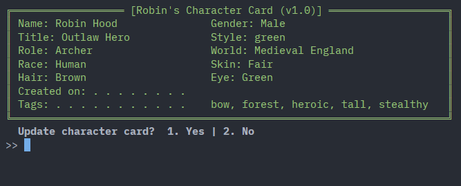
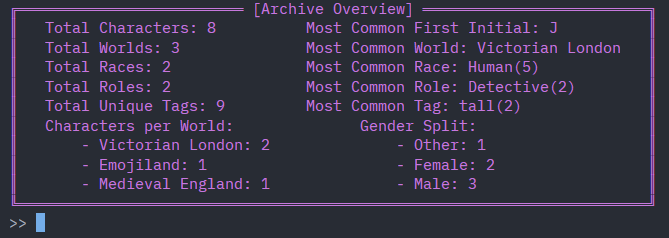

# Perindex‑Tool — v1.0 🍐
## About (Pear-what-now?)
Perindex-Tool is a terminal‑based character archival tool I built for keeping track of my many characters across multiple fictional worlds and settings.
It provides a fast and easy way to create, sort and retrieve locally stored character cards in a stable, human-readable format.

Here's an example of a card:


And here's an example of what an overview of the archive—or collection of character cards—could look like:



## Requirements
- Python 3.10+ (You can check your python version with this:)
```
python --version
```
- pip
(Most Python installations already include pip. If your system doesn't have it, you can install/upgrade it with:)
```
python -m pip install --upgrade pip
```
Note: If *python* doesn't work in the console, try *python3* in its place

## How To Use
Starting in your preferred terminal:
1. Clone the repo
```
git clone https://github.com/kahldin-m/perindex-tool.git
```
2. Enter the project folder
```
cd perindex-tool
```
3. Install perindex as a package (editable mode)
```
pip install -e .
```
4. Run the tool
```
perindex
```

### Third-Party Libraries Used
  - PyYAML
  - Rich

### To-Do
- Day 1: CLI Initialization ✔
  - Menu, routing, loop, placeholder functions.
- Day 2: Character Creation ✔
  - Prompt user -> build YAML -> save file.
- Day 3: Load Character ✔
  - Load character cards by smart-name search from saved yaml file.
- Day 4: Sorting ✔
  - Sort by name, world, creation date, etc.
- Day 5: Dev Tool ✔
  - Dev tool updates specific card fields across all cards
- Day 6: Archive Data Overview + Add "date_created" to cards ✔
  - List metadata across the whole archive of character cards. e.g., total cards, total count of fields, etc.
- Day 7: Schema Validation + Data Integrity + Update Tool ✔
  - Validate and auto-fix existing cards ; open cards to edit fields and save upadtes.
- Day 8: Function Modularity and Cleanup ✔
  - Refactor functions for modularity. (tag editor, card color)
  - Clean up unused or temp. commented code.
  - Tighten search scope?
  - Ability to delete cards 😅
